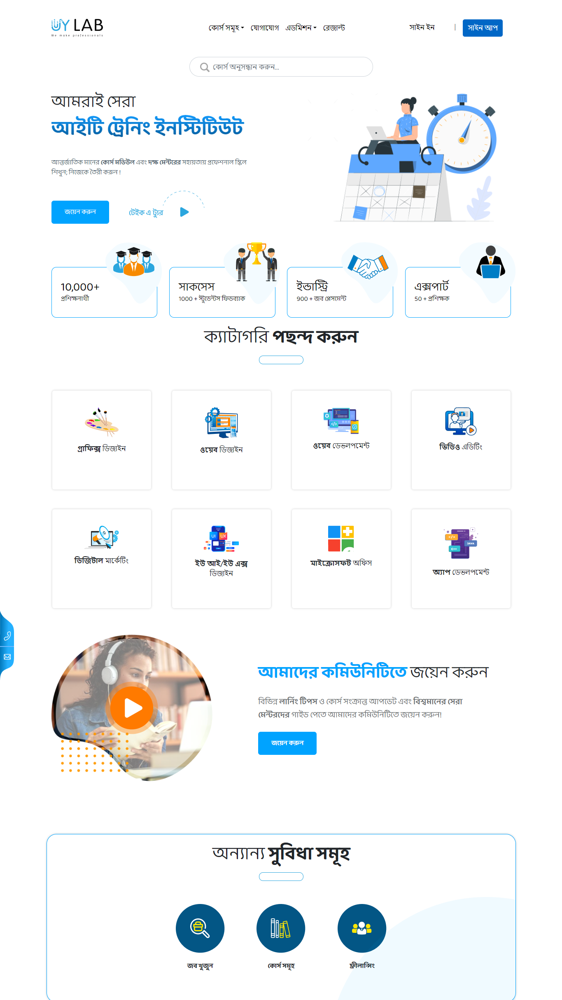

# lms (web template)

It is a simple web template for lms (Learning Management System).Also it is a multi-page site for a lms(uylab). It is user frindly & try to maintain clen code.

## Author

-   [@maruf](https://github.com/maruf-ux)

## Features

-   Navbar
-   Hero Section
-   RWD (Responsive Web Design)
-   Multipage (homepage, contact, student page, student feedback, it industry)

## Screenshots

